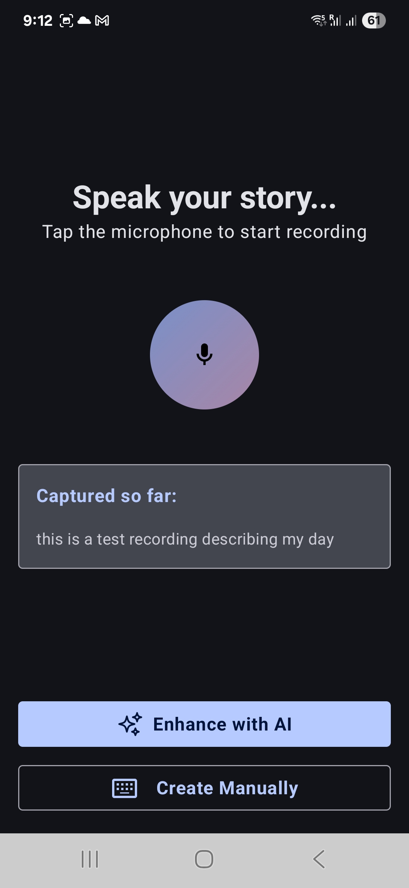
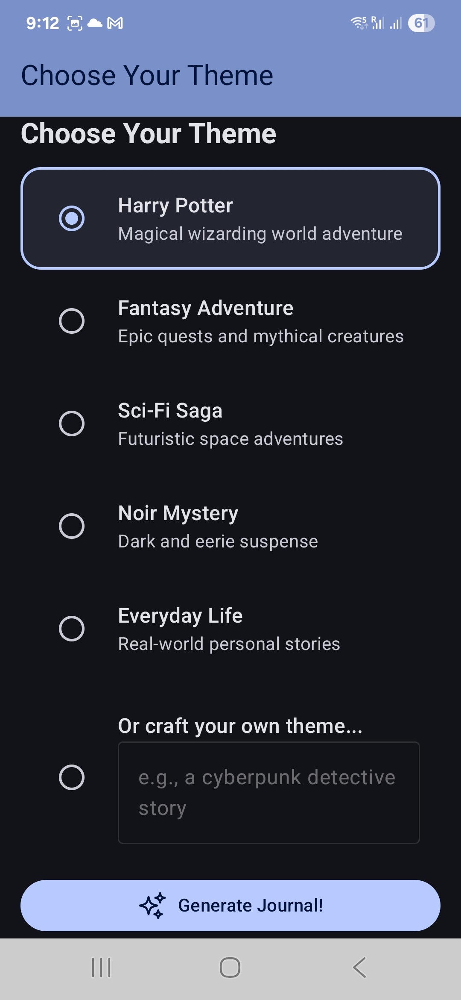
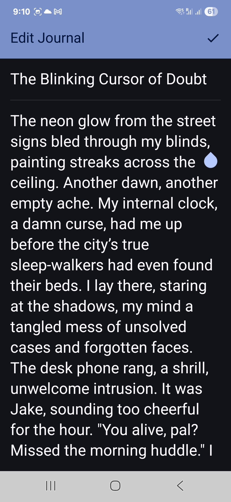
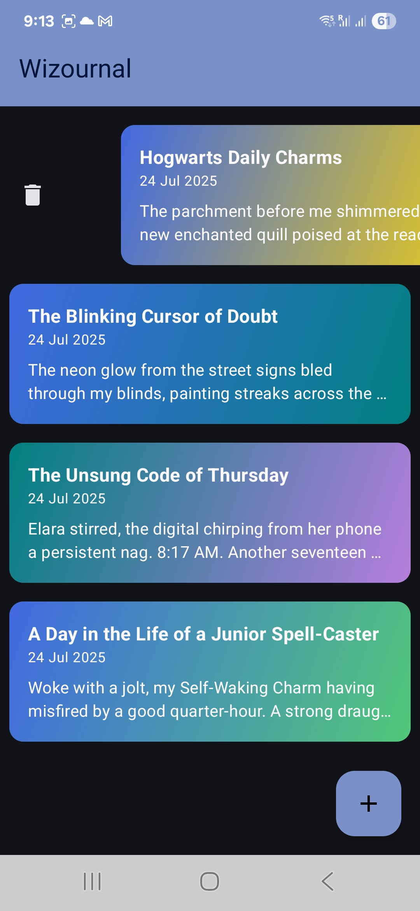

# Wizournal: Your AI-Powered Magical Journal ✨

Wizournal transforms your daily thoughts into enchanting, AI-enhanced stories directly on your Android device. 
Web app repo: https://github.com/Sk-singla/wizournal-web-app 
Backend: https://github.com/Sk-singla/wizard_journal_backend

## Live Web App
https://wizournal.vercel.app

## DeepWiki
https://deepwiki.com/Sk-singla/WizardJournal

## Key Features

* **AI Journaling:** Effortlessly create daily entries with intelligent AI assistance.
* **Story Transformation:** Turn "boring" notes into captivating narratives (e.g., Harry Potter, Fantasy) using AI themes.
* **Journal Management:**
  * **Create, Edit:** Easily manage your entries.
  * **Delete:** Intuitive **swipe-to-delete** action.
* **Dynamic Visuals:** AI generates unique backgrounds (colors, gradients, patterns) for each journal, matching its story and theme.
* **Voice Input:** Speak your journals using **Android's native speech-to-text**.
* **Permissions:** Handles **recording permissions** securely and smoothly.
* **Jwt Authentication:** Authenticate user using jwt with spring boot backend: https://github.com/Sk-singla/wizard_journal_backend

## Architecture

The app is built following **Clean Architecture principles**, with a presentation layer utilizing **MVVM (Model-View-ViewModel)** and **Unidirectional Data Flow (UDF)** for robust, scalable, and testable UI development.

## Tech Stack

* **Jetpack Compose:** Modern Android UI.
* **Room:** Robust local database for journal storage.
* **Koin:** Lightweight dependency injection for modularity.
* **Gemini API:** Powers all core AI capabilities.

## Screenshots

Explore the magic of Wizournal through these app screenshots:

| Home Page | Record Your Day | Recording... (Listening) |
| :--------: | :-------------: | :-----------------------: |
|  |  |  |

| Captured Text | Theme Selection (Default) | Theme Selection (Options) |
| :------------: | :-----------------------: | :--------------------------: |
|  |  |  |

| View Journal | Edit Journal | Swipe to Delete |
| :----------: | :----------: | :-------------: |
|  |  |  |

---
