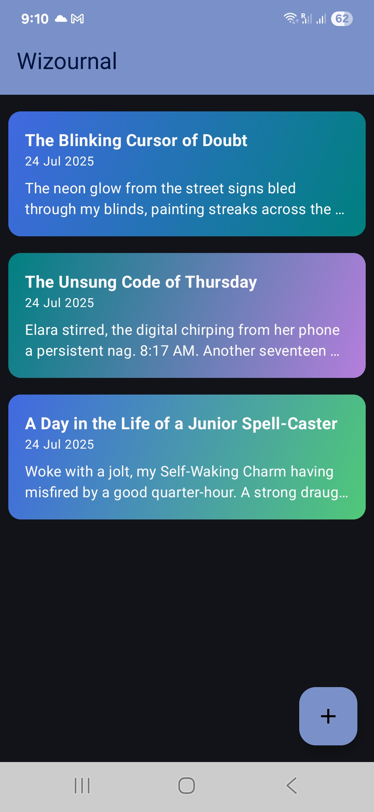
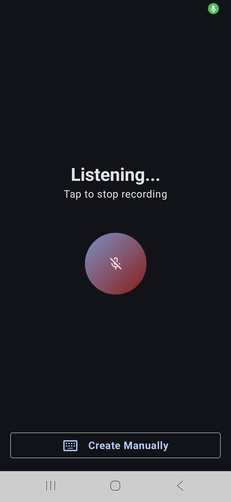
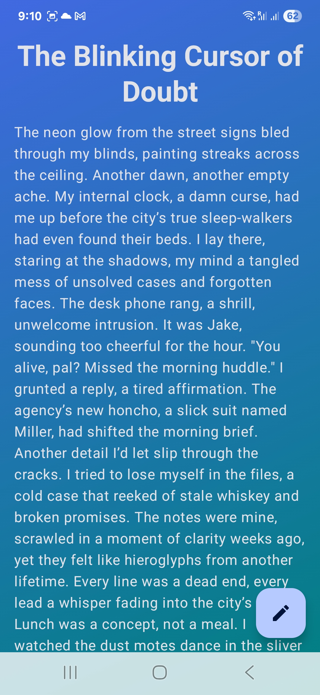

# Wizournal: Your AI-Powered Magical Journal ✨

Wizournal transforms your daily thoughts into enchanting, AI-enhanced stories directly on your Android device.

## Key Features

* **AI Journaling:** Effortlessly create daily entries with intelligent AI assistance.
* **Story Transformation:** Turn "boring" notes into captivating narratives (e.g., Harry Potter, Fantasy) using AI themes.
* **Journal Management:**
  * **Create, Edit:** Easily manage your entries.
  * **Delete:** Intuitive **swipe-to-delete** action.
* **Dynamic Visuals:** AI generates unique backgrounds (colors, gradients, patterns) for each journal, matching its story and theme.
* **Voice Input:** Speak your journals using **Android's native speech-to-text**.
* **Permissions:** Handles **recording permissions** securely and smoothly.

## Tech Stack

* **Jetpack Compose:** Modern Android UI.
* **Room:** Robust local database for journal storage.
* **Koin:** Lightweight dependency injection for modularity.
* **Gemini API:** Powers all core AI capabilities.

## Screenshots

Explore the magic of Wizournal through these app screenshots:

| Home Page | Record Your Day | Recording... (Listening) |
| :--------: | :-------------: | :-----------------------: |
|  |  |  |

| Captured Text | Theme Selection (Default) | Theme Selection (Options) |
| :------------: | :-----------------------: | :--------------------------: |
|  |  |  |

| View Journal | Edit Journal | Swipe to Delete |
| :----------: | :----------: | :-------------: |
|  |  |  |

---